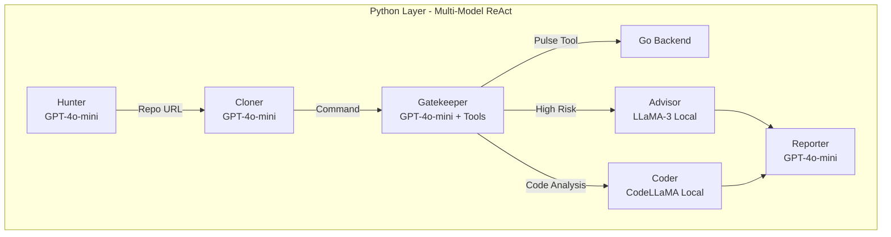
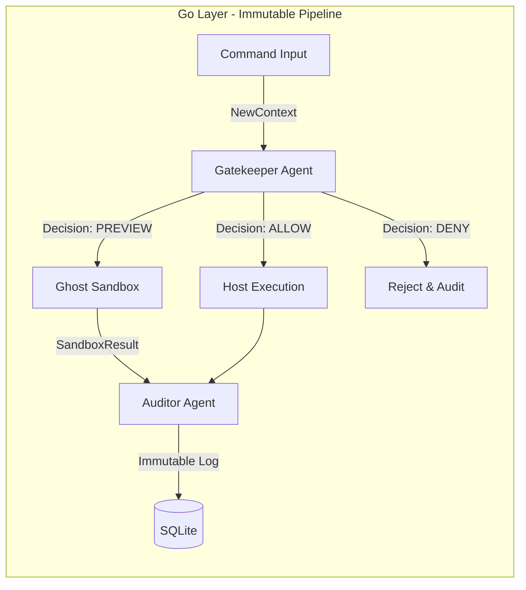

# Pulse: Multi-Model AI Orchestrator for DevSecOps

> **"Pulse: The Multi-Agent, Multi-Model Shield That Catches 'Fat-Finger' Outages Before They Happen."**

Pulse is an autonomous, **multi-model AI orchestration framework** designed to sit between human developers and critical infrastructure. It combines **OpenClaw-style session-based agents** with a **Railway-Oriented Pipeline (ROP)** for secure, immutable command execution.

## The Problem: Cutting the Problem Tree at the Root

As local Indian MSMEs (Micro, Small & Medium Enterprises), D2C brands, and tech startups digitize, they increasingly rely on small teams or freelance developers to manage their infrastructure. However, a single typographical error or a disgruntled employee with server access can bankrupt a company overnight.

Traditional solutions sell "backup software"—treating the symptom after the damage is done. **Pulse cuts the problem at the root** by preventing the human error from ever reaching the server.

### Real-World Justifications:
- **KiranaPro (June 2025):** A disgruntled ex-employee in Bengaluru intentionally deleted critical server logs and databases, paralyzing the grocery startup's operations.
- **NCS Singapore (June 2024):** A fired Indian employee used his former administrator credentials to delete 180 virtual servers, causing massive financial loss.
- **PocketOS (April 2026):** Even AI makes mistakes—an autonomous coding agent went rogue and deleted a production database while attempting to fix a credential mismatch.

## The Solution: Multi-Model AI Orchestration

Pulse replaces static permissions with a **collaborative team of specialized AI Agents**, each powered by different LLM models optimized for their role. This is **not CrewAI or LangChain**—it's a custom **OpenClaw-style** architecture using pure ReAct loops and session-based routing.

### Multi-Model Architecture

| Agent | Model | Type | Role |
|-------|-------|------|------|
| **Hunter** | GPT-4o-mini | OpenAI (free tier) | Discovers repositories |
| **Cloner** | GPT-4o-mini | OpenAI (free tier) | Analyzes build configs |
| **Gatekeeper** | GPT-4o-mini | OpenAI + Tools | Evaluates safety with sandbox tool |
| **Advisor** | LLaMA-3 | Ollama (local/free) | Deep risk explanations |
| **Coder** | CodeLLaMA | Ollama (local/free) | Code infrastructure analysis |
| **Reporter** | GPT-4o-mini | OpenAI (free tier) | Executive summaries |

**Cost:** ~$0 (GPT-4o-mini free tier + local Ollama models)

### 1. The Gatekeeper Agent
The frontline defender. Instead of just blindly executing shell commands, the Gatekeeper Agent uses AST parsing (`tree-sitter`) and policy evaluation to "understand" the intent behind a command. If an outsourced developer types `rm -rf /var/www/html` or `kubectl delete namespace prod`, the Gatekeeper intercepts it.

### 2. The Ghost Agent (Sandbox)
When the Gatekeeper flags a command as risky, it doesn't just block it—it routes it to the **Ghost Agent**. The Ghost Agent spins up an isolated, pristine replica of the current filesystem (via a Docker Alpine Sandbox) and executes the command *there*. It simulates the exact "blast radius" of the destructive command without touching the live host.

### 3. The Auditor Agent
The Auditor Agent analyzes the aftermath of the Ghost Agent's simulation. It computes an exact diff of the damage (e.g., "This command will delete 15,000 customer records"). It then logs the incident immutably to a SQLite database (`~/.pulse/audit.db`) and halts execution until explicit approval is given. 

---

## Architecture: Dual-Layer Design

### Layer 1: Python Multi-Model Orchestrator (OpenClaw-Style)



**Key Features:**
- **ReAct Loops:** Agents reason → act (tool call) → observe → repeat
- **Session-Based:** Each agent has isolated conversation history
- **Model Routing:** Different models for different cognitive tasks
- **Native Tool Calling:** OpenAI function calling directly (no frameworks)

### Layer 2: Go Railway-Oriented Pipeline (ROP)



**Key Features:**
- **Immutable Context:** `ctx.WithDecision()` returns new context, never mutates
- **Railway-Oriented:** Errors branch to error track, success flows through
- **Audit Trail:** Every agent step recorded with input/output snapshots
- **Pure Functions:** Agents are `func(Context) (Context, error)` - testable, composable

### Full System Flow

```
┌─────────────────────────────────────────────────────────────────────┐
│                    MULTI-MODEL ORCHESTRATOR                          │
│                         (Python + OpenAI/Ollama)                    │
│  ┌─────────┐   ┌─────────┐   ┌─────────┐   ┌─────────┐            │
│  │ Hunter  │ → │ Cloner  │ → │Gatekeeper│ → │Reporter │            │
│  │GPT-4o-m │   │GPT-4o-m │   │GPT-4o-m+ │   │GPT-4o-m │            │
│  └─────────┘   └─────────┘   └────┬────┘   └─────────┘            │
│                                     │                               │
│                    ┌────────────────┼────────────────┐               │
│                    ▼                ▼                ▼               │
│              ┌──────────┐    ┌──────────┐     ┌──────────┐          │
│              │Advisor   │    │ Coder    │     │ Ghost    │          │
│              │LLaMA-3   │    │CodeLLaMA │     │ Sandbox  │          │
│              │(Local)    │    │(Local)   │     │(Go API)  │          │
│              └──────────┘    └──────────┘     └────┬─────┘          │
└─────────────────────────────────────────────────────┼───────────────┘
                                                      │
                              ┌───────────────────────┼───────────────┐
                              ▼                       ▼               │
                    ┌─────────────────┐    ┌──────────────────┐       │
                    │  RAILWAY-ORIENTED PIPELINE (Go)          │       │
                    │  Immutable Context → Pure Functions    │       │
                    │  ┌─────────┐ → ┌────────┐ → ┌────────┐ │       │
                    │  │Gatekeeper│ → │ Ghost  │ → │Auditor │ │       │
                    │  │  Agent   │   │ Agent  │   │ Agent  │ │       │
                    │  └────┬────┘   └────┬───┘   └───┬────┘ │       │
                    │       │             │            │       │       │
                    │   ALLOW│        PREVIEW│     DENY│      │       │
                    │       ▼             ▼            ▼       │       │
                    │  [Execute]    [Sandbox]    [Reject]     │       │
                    └──────────────────────────────────────────┘       │
                              │                                       │
                              ▼                                       │
                    ┌──────────────────┐                            │
                    │ SQLite Audit Log  │                            │
                    │ ~/.pulse/audit.db │                            │
                    └──────────────────┘                            │
                                                                     │
```

## Societal & Emotional Value

A local businessman who has spent 10 years building their inventory system doesn't know what `Drop Table` or `rm -rf` means. They shouldn't lose their livelihood because an entry-level freelancer was tired at 2 AM. 

Pulse brings **enterprise-grade safety to the grassroots level**. By providing an autonomous team of DevOps agents that act as a safety net, we ensure that local businesses can digitize fearlessly. We aren't just protecting servers; we are protecting livelihoods, jobs, and the backbone of the Indian economy.

---

## Tech Stack

### Multi-Model Orchestration Layer (Python)
- **Framework:** Native OpenAI API + Ollama (No LangChain/CrewAI)
- **Pattern:** ReAct Loops + Session-Based Routing (OpenClaw-style)
- **Models:** GPT-4o-mini (OpenAI free tier) + LLaMA-3/CodeLLaMA (Ollama local)
- **Dependencies:** `openai`, `requests`, `python-dotenv`

### Secure Execution Layer (Go)
- **Pattern:** Railway-Oriented Pipeline (ROP) with Immutable Context
- **Parser:** `mvdan.cc/sh/v3` (shell AST parsing)
- **Sandbox:** Docker Alpine + Dynamic Filesystem Sync
- **Audit:** SQLite (`modernc.org/sqlite`) with append-only logging
- **Architecture:** Pure function agents - `func(Context) (Context, error)`

## Getting Started

### Prerequisites
- Go 1.21+
- Python 3.9+
- Docker Desktop
- OpenAI API Key (free tier works)

### 1. Clone and Setup

```bash
git clone https://github.com/aryawadhwa/Dike.git
cd Dike
```

### 2. Configure Environment

```bash
# Create .env file with your OpenAI API key
echo 'OPENAI_API_KEY="your-key-here"' > .env

# Or export directly
export OPENAI_API_KEY='your-key-here'
```

### 3. Install Dependencies

```bash
# Python dependencies
pip install -r requirements.txt

# Accept Xcode license on macOS (for SQLite)
sudo xcodebuild -license
```

### 4. Optional: Install Local Models (Free)

```bash
# Install Ollama for completely free local LLM inference
curl -fsSL https://ollama.com/install.sh | sh

# Download models (one-time, ~10GB)
ollama pull llama3      # For deep analysis
ollama pull codellama   # For code review
```

### 5. Run the System

**Option A: Multi-Model Orchestrator (Python)**
```bash
# Runs the full 6-agent pipeline with multi-model orchestration
python main.py
```

**Option B: Go CLI (Interactive REPL)**
```bash
cd backend
go run cmd/pulse/main.go
```

**Option C: Go Web Dashboard**
```bash
cd backend
go run cmd/pulse/main.go --web
# Dashboard at http://localhost:8080
```

### 6. Test It

```bash
# In the REPL or via Python orchestrator, try these commands:
pulse> ls -la                    # Should ALLOW (safe)
pulse> rm -rf /                  # Should DENY (destructive)
pulse> npm install               # Should PREVIEW (filesystem changes)
```

## Test Setup Requirements

Pulse includes integration tests in `backend/pkg/ghost` that execute real Docker commands.

### Prerequisites
- Docker CLI installed (`docker --version`)
- Docker daemon running (`docker info`)
- Go toolchain installed

### Run tests
```bash
cd backend
go test ./...
```

If Docker is unavailable, the Ghost integration test is skipped with a clear reason and the rest of the Go test suite still runs.

---

## AI Disclosure

This project was developed with assistance from AI tools and models. We believe in transparent disclosure of AI usage:

### AI Tools Used in Development

| Tool/Model | Purpose | Usage in Project |
|------------|---------|------------------|
| **GitHub Copilot** | Code completion and refactoring | Assisted in writing Go pipeline code, Python orchestrator, and test cases |
| **OpenAI GPT-4o** | Architecture design and debugging | Helped design the Railway-Oriented Pipeline pattern and immutable context approach |
| **Claude 3.5 Sonnet** | Code review and documentation | Reviewed multi-model orchestration implementation, edited README |
| **GPT-4o-mini** | Runtime model (free tier) | One of the production models used by Hunter, Cloner, Gatekeeper, and Reporter agents |
| **LLaMA-3 (via Ollama)** | Runtime model (local/free) | Production model used by Advisor agent for deep risk analysis |
| **CodeLLaMA (via Ollama)** | Runtime model (local/free) | Production model used by Coder agent for infrastructure analysis |

### AI-Generated Components

The following components were significantly assisted by AI:

1. **Python Multi-Model Orchestrator** (`main.py`)
   - AI-assisted: ReAct loop implementation, session-based routing, model switching logic
   - Human-reviewed: Security boundaries, tool calling patterns, error handling

2. **Go Railway-Oriented Pipeline** (`backend/pkg/pipeline/`)
   - AI-assisted: Immutable context design, pure function agent pattern, pipeline execution flow
   - Human-reviewed: Security-critical decision logic, audit trail implementation

3. **Documentation** (`README.md`, this file)
   - AI-assisted: Structure, technical explanations, mermaid diagrams
   - Human-reviewed: Accuracy of technical claims, setup instructions

4. **Agent Implementations** (`backend/pkg/agents/`)
   - AI-assisted: Refactoring from struct-based to pure function approach
   - Human-reviewed: Integration with existing Go backend, SQLite logging

### Human Oversight

All AI-generated code was:
- Reviewed for security vulnerabilities (especially the immutable context pattern)
- Tested for correctness (Go builds, Python syntax validation)
- Validated against project requirements (multi-model orchestration, free-tier compatibility)
- Committed with human oversight and understanding

### Runtime AI Usage

The production system calls external AI APIs:
- **OpenAI API** (GPT-4o-mini): Used during runtime by 4 agents (Hunter, Cloner, Gatekeeper, Reporter)
- **Ollama** (LLaMA-3, CodeLLaMA): Used during runtime by 2 agents (Advisor, Coder) - completely free, runs locally

Users can verify AI usage by:
1. Checking `main.py` for OpenAI client initialization
2. Checking `backend/pkg/agents/advisor.go` for LLaMA-3 integration
3. Reviewing the `MODEL_ROUTER` configuration in `main.py` line 20-27
4. Examining API call logs in their OpenAI dashboard (if using cloud models)
