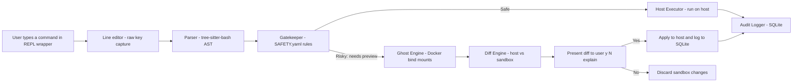

# Pulse (Project Dike)

Pulse is a command interception framework designed to sit between the user and actual host execution. It intercepts terminal commands, evaluates their risk profile against custom policies, and runs risky commands inside a lightweight "ghost sandbox" to present a safe, git-like diff before allowing host execution.

## 🚀 Core Idea

For "risky" commands:
1. **Intercept**: Catch the command before execution.
2. **Sandbox**: Run it in a ghost sandbox (Docker Alpine container).
3. **Diff**: Compute a diff against the host filesystem.
4. **Prompt**: Ask the user `[y/N/explain]`. Only apply to the host if approved.

---

## 🏗 Architecture



## 🧩 Components

### 1. Intercept Layer (REPL Wrapper)
A custom Go-based shell wrapper (`pulse` CLI) using a line editor (`charmbracelet/bubbletea` or `liner`). Captures input, pipes it to the Gatekeeper, and handles execution on the host if approved.

### 2. Gatekeeper (Parser + Policy Engine)
- **Parser**: Uses `tree-sitter-bash` to generate an AST and extract command names, paths, arguments, and redirections.
- **Policy Engine**: Evaluates the parsed AST against `SAFETY.yaml`.
- Outputs a decision: `ALLOW`, `PREVIEW`, or `DENY`.

### 3. Ghost Engine (Sandbox)
A long-lived, lightweight Docker Alpine container. When a command needs a `PREVIEW`, Pulse securely `docker exec`s into the container using read-only host bind mounts or temporary file copies to ensure the original host remains pristine.

### 4. Diff Engine
Compares the filesystem state between the host and the Ghost sandbox after command execution. Generates human-readable, unified diffs showing file creations, modifications, and deletions.

### 5. Audit Logger
A single-file SQLite database (`~/.pulse/audit.db`) that records every intercepted command, including timestamps, users, risk levels, and the final decision (Applied/Rejected).

### 6. "High-Tier Brain" (LLM Explain)
*(Optional / Opt-in)* When a user types `[explain]` on a prompted diff, Pulse queries a local LLM (e.g., Ollama Llama-3) with the AST and diff to provide plain-english context on what the command intends to do.

---

## 🛠 Tech Stack (v0)

- **Language:** Go (Single binary distribution)
- **Parser:** `tree-sitter-bash`
- **Sandbox:** Docker + Bind mounts
- **Database:** SQLite (`mattn/go-sqlite3`)
- **CLI/REPL:** `charmbracelet/bubbletea` or `liner`
- **Policy:** YAML (`SAFETY.yaml`)

---

## 📂 Project Structure

```text
pulse/
  ├── cmd/pulse/          # Main CLI entrypoint
  ├── pkg/
  │   ├── repl/           # Line editor and main loop
  │   ├── gatekeeper/     # Rules, decision logic, and tree-sitter integration
  │   ├── ghost/          # Docker sandbox management
  │   ├── diff/           # Host vs Sandbox diff generation
  │   ├── audit/          # SQLite logger
  │   └── policy/         # Load SAFETY.yaml
  ├── configs/            # Configuration files
  ├── examples/           # Sample SAFETY.yaml policies
  ├── go.mod
  └── README.md
```

---

## 🛣 Roadmap & Phases

- [x] **Phase 0:** Project repository and basic REPL skeleton.
- [ ] **Phase 1:** Gatekeeper (AST parsing and YAML policy evaluation).
- [ ] **Phase 2:** Ghost Engine (Docker sandbox initialization and execution).
- [ ] **Phase 3:** Diff Engine (Generating readable filesystem diffs).
- [ ] **Phase 4:** Host Executor & SQLite Audit Logging.
- [ ] **Phase 5:** UX Polish, colored terminal output, and LLM explanation integration.

## 🔮 Future Scope

- Move from Docker to `nsjail` + `OverlayFS` for lower overhead and faster startup.
- Support per-project `SAFETY.yaml` rules.
- Optional eBPF-based kernel interception for non-Pulse shells.
- Web dashboard for viewing audit logs (SOC2 compliance).
