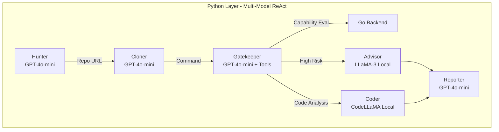
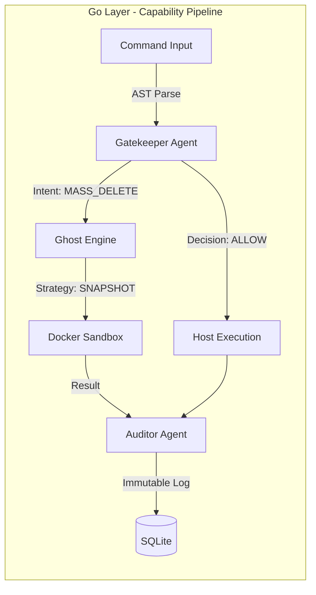

# Pulse: Multi-Model AI Orchestrator for DevSecOps

> **"Pulse: The Multi-Agent, Multi-Model Shield That Catches 'Fat-Finger' Outages Before They Happen."**

Pulse is an autonomous, **multi-model AI orchestration framework** designed to sit between human developers and critical infrastructure. It combines **OpenClaw-style session-based agents** with a **Capability-Based Zero Trust** pipeline for secure, intent-aware command execution.

## The Problem: Cutting the Problem Tree at the Root

As local Indian MSMEs (Micro, Small & Medium Enterprises), D2C brands, and tech startups digitize, they increasingly rely on small teams or freelance developers to manage their infrastructure. However, a single typographical error or a disgruntled employee with server access can bankrupt a company overnight.

Traditional solutions sell "backup software"—treating the symptom after the damage is done. **Pulse cuts the problem at the root** by preventing the human error from ever reaching the server.

### Real-World Justifications:
- **KiranaPro (June 2025):** A disgruntled ex-employee in Bengaluru intentionally deleted critical server logs and databases, paralyzing the grocery startup's operations.
- **NCS Singapore (June 2024):** A fired Indian employee used his former administrator credentials to delete 180 virtual servers, causing massive financial loss.
- **PocketOS (April 2026):** Even AI makes mistakes—an autonomous coding agent went rogue and deleted a production database while attempting to fix a credential mismatch.

## The Solution: Capability-Based AI Orchestration

Pulse replaces static permissions with a **collaborative team of specialized AI Agents**, utilizing a **Capability-Based Zero Trust** model to evaluate command intent rather than simple string matching.

### Multi-Model Architecture

| Agent | Model | Type | Role |
|-------|-------|------|------|
| **Hunter** | GPT-4o-mini | OpenAI (free tier) | Discovers repositories |
| **Cloner** | GPT-4o-mini | OpenAI (free tier) | Analyzes build configs |
| **Gatekeeper** | GPT-4o-mini | OpenAI + Tools | Evaluates intent with Capability Model |
| **Advisor** | LLaMA-3 | Ollama (local/free) | Deep risk explanations |
| **Coder** | CodeLLaMA | Ollama (local/free) | Code infrastructure analysis |
| **Reporter** | GPT-4o-mini | OpenAI (free tier) | Executive summaries |

**Cost:** ~$0 (GPT-4o-mini free tier + local Ollama models)

### 1. The Gatekeeper Agent (The Moment of Intent Interception)
The frontline defender. Instead of just blindly executing shell commands or checking a blocklist, the Gatekeeper uses **AST-aware semantic analysis** to understand the command's **Capability**. It detects destructive patterns like recursive deletion or credential exposure instantly, determining if a command is safe or requires simulation.

### 2. The Ghost Agent (The Ghost Moat)
Pulse replaces "AI Hallucinations" with "Simulated Reality." When a command is flagged as risky, the Ghost Engine chooses a **Sandbox Strategy** tailored to its intent:
- **SNAPSHOT**: Uses OverlayFS-style snapshots to capture `MASS_DELETE` operations, revealing the exact "Blast Radius" of a command before it reaches the kernel.
- **FAKEROOT**: Simulates root privileges for `SYSTEM_MODIFY` tasks.
- **NETWORK_ISO**: Provides a controlled environment for `EXEC_ARBITRARY` tasks with strict outbound rules.

### 3. The Auditor Agent (The Risk Revelation)
The Auditor Agent analyzes the aftermath of the Ghost Agent's simulation. It performs a bitwise comparison between the original and post-execution states to generate a definitive **Impact Report**. This allows for an evidence-based human override or commitment, finalized with an immutable entry in the SQLite Audit DB.

---

## Real-World Scenarios

- **The "Fat-Finger" Deployment Error:** A developer accidentally types `rm -rf /` instead of a local directory. Pulse intercepts and simulates the command in the Ghost Sandbox, revealing that 15,000 system files would be deleted, prompting an immediate block.
- **The Disgruntled Ex-Employee:** An administrator tries to run `db.dropDatabase()` on a production instance using cached credentials. The Gatekeeper Agent identifies the high-risk intent and prevents the malicious wipe via simulation-based blocking.
- **The Malicious Dependency Hook:** A developer runs `npm install` on a package containing a hidden script. The Shell AST Parser detects the unauthorized network egress and file access, revealing the malicious "Blast Radius" before the host is compromised.

---

## Competitive MOAT

- **The Ghost Moat (Simulation Logic):** Pulse has built a proprietary bridge between high-level Agentic Reasoning and low-level Container State Simulation. While competitors only "read" commands, Pulse "rehearses" them.
- **The Inference Moat (Hybrid Intelligence):** Pulse maintains a strategic advantage through its Multi-Model Routing Architecture. By offloading sensitive infrastructure analysis to local Ollama models while using Cloud LLMs for orchestration, we provide enterprise-grade safety at near-zero token cost.

---

## Scale Potential

- **Distributed Security Mesh:** Scaling from a single-node protector to a distributed "Security Mesh" that synchronizes audit logs and safety policies across thousands of cloud instances.
- **Enterprise Policy Engine:** Expanding into a global marketplace where organizations download specialized "Agentic Guardrails" for specific stacks like Kubernetes, AWS, or Azure.
- **Edge-Device Security:** Deploying on IoT devices and edge gateways to provide autonomous, on-device security for the industrial internet backbone.

---

## Architecture: Dual-Layer Design

### Layer 1: Python Multi-Model Orchestrator (OpenClaw-Style)



**Key Features:**
- **ReAct Loops:** Agents reason → act (tool call) → observe → repeat
- **Session-Based:** Each agent has isolated conversation history
- **Model Routing:** Different models for different cognitive tasks
- **Native Tool Calling:** OpenAI function calling directly (no frameworks)

### Layer 2: Go Zero-Trust Pipeline (Railway-Oriented)



**Key Features:**
- **Zero Trust Modeling:** Intent-based capability detection over raw string matching.
- **Railway-Oriented:** Success flows forward; security violations branch to the error track.
- **Audit Trail:** Every agent step recorded with input/output snapshots.
- **Pure Functions:** Agents are `func(Context) (Context, error)` - testable and composable.

### Full System Flow

```
┌─────────────────────────────────────────────────────────────────────┐
│                    MULTI-MODEL ORCHESTRATOR                          │
│                         (Python + OpenAI/Ollama)                    │
│  ┌─────────┐   ┌─────────┐   ┌─────────┐   ┌─────────┐            │
│  │ Hunter  │ → │ Cloner  │ → │Gatekeeper│ → │Reporter │            │
│  │GPT-4o-m │   │GPT-4o-m │   │GPT-4o-m+ │   │GPT-4o-m │            │
│  └─────────┘   └─────────┘   └────┬────┘   └─────────┘            │
│                                     │                               │
│                    ┌────────────────┼────────────────┐               │
│                    ▼                ▼                ▼               │
│              ┌──────────┐    ┌──────────┐     ┌──────────┐          │
│              │Advisor   │    │ Coder    │     │ Ghost    │          │
│              │LLaMA-3   │    │CodeLLaMA │     │ Sandbox  │          │
│              │(Local)    │    │(Local)   │     │(Go API)  │          │
│              └──────────┘    └──────────┘     └────┬─────┘          │
└─────────────────────────────────────────────────────┼───────────────┘
                                                      │
                              ┌───────────────────────┼───────────────┐
                              ▼                       ▼               │
                    ┌─────────────────┐    ┌──────────────────┐       │
                    │  RAILWAY-ORIENTED PIPELINE (Go)          │       │
                    │  Immutable Context → Pure Functions    │       │
                    │  ┌─────────┐ → ┌────────┐ → ┌────────┐ │       │
                    │  │Gatekeeper│ → │ Ghost  │ → │Auditor │ │       │
                    │  │  Agent   │   │ Agent  │   │ Agent  │ │       │
                    │  └────┬────┘   └────┬───┘   └───┬────┘ │       │
                    │       │             │            │       │       │
                    │   ALLOW│        PREVIEW│     DENY│      │       │
                    │       ▼             ▼            ▼       │       │
                    │  [Execute]    [Sandbox]    [Reject]     │       │
                    └──────────────────────────────────────────┘       │
                              │                                       │
                              ▼                                       │
                    ┌──────────────────┐                            │
                    │ SQLite Audit Log  │                            │
                    │ ~/.pulse/audit.db │                            │
                    └──────────────────┘                            │
                                                                     │
```

## for whom?

A local businessman who has spent 10 years building their inventory system doesn't know what `Drop Table` or `rm -rf` means. They shouldn't lose their livelihood because an entry-level freelancer was tired at 2 AM. 

Pulse brings **enterprise-grade safety to the grassroots level**. By providing an autonomous team of DevOps agents that act as a safety net, we ensure that local businesses can digitize fearlessly. We aren't just protecting servers; we are protecting livelihoods, jobs, and the backbone of the Indian economy.

---

## Tech Stack

### Multi-Model Orchestration Layer (Python)
- **Framework:** Native OpenAI API + Ollama (No LangChain/CrewAI)
- **Pattern:** ReAct Loops + Session-Based Routing (OpenClaw-style)
- **Models:** GPT-4o-mini (OpenAI free tier) + LLaMA-3/CodeLLaMA (Ollama local)
- **Dependencies:** `openai`, `requests`, `python-dotenv`

### Secure Execution Layer (Go)
- **Pattern:** Railway-Oriented Pipeline (ROP) with Immutable Context
- **Parser:** `mvdan.cc/sh/v3` (shell AST parsing)
- **Sandbox:** Docker Alpine + Dynamic Filesystem Sync
- **Audit:** SQLite (`modernc.org/sqlite`) with append-only logging
- **Architecture:** Pure function agents - `func(Context) (Context, error)`

## Getting Started

### Prerequisites
- Go 1.21+
- Python 3.9+
- Docker Desktop
- OpenAI API Key (free tier works)

### 1. Clone and Setup

```bash
git clone https://github.com/aryawadhwa/Dike.git
cd Dike
```

### 2. Configure Environment

```bash
# Create .env file with your OpenAI API key
echo 'OPENAI_API_KEY="your-key-here"' > .env

# Or export directly
export OPENAI_API_KEY='your-key-here'
```

### 3. Install Dependencies

```bash
# Python dependencies
pip install -r requirements.txt

# Accept Xcode license on macOS (for SQLite)
sudo xcodebuild -license
```

### 4. Optional: Install Local Models (Free)

```bash
# Install Ollama for completely free local LLM inference
curl -fsSL https://ollama.com/install.sh | sh

# Download models (one-time, ~10GB)
ollama pull llama3      # For deep analysis
ollama pull codellama   # For code review
```

### 5. Run the System

**Option A: Multi-Model Orchestrator (Python)**
```bash
# Runs the full 6-agent pipeline with multi-model orchestration
python main.py
```

**Option B: Go CLI (Interactive REPL)**
```bash
cd backend
go run cmd/pulse/main.go
```

**Option C: Go Web Dashboard**
```bash
cd backend
go run cmd/pulse/main.go --web
# Dashboard at http://localhost:8080
```

### 6. Test It

```bash
# In the REPL or via Python orchestrator, try these commands:
pulse> ls -la                    # Should ALLOW (safe)
pulse> rm -rf /                  # Should DENY (destructive)
pulse> npm install               # Should PREVIEW (filesystem changes)
```

## Test Setup Requirements

Pulse includes integration tests in `backend/pkg/ghost` that execute real Docker commands.

### Prerequisites
- Docker CLI installed (`docker --version`)
- Docker daemon running (`docker info`)
- Go toolchain installed

### Run tests
```bash
cd backend
go test ./...
```

If Docker is unavailable, the Ghost integration test is skipped with a clear reason and the rest of the Go test suite still runs.

---

## AI Disclosure

This project was developed with assistance from AI tools and models. We believe in transparent disclosure of AI usage:

### AI Tools Used in Development

| Tool/Model | Purpose | Usage in Project |
|------------|---------|------------------|
| **Windsurf (Cascade)** | Primary AI coding assistant | End-to-end development: architecture design, code implementation, refactoring, documentation, git operations |
| **WARP Oz Agent** | Terminal-based AI assistance | Terminal commands, file operations, codebase navigation |
| **Z.ai** | AI model access | Alternative model interface for testing and validation |
| **Antigravity** | AI development tool | Code review and debugging assistance |
| **GitHub Copilot** | Code completion and refactoring | Assisted in writing Go pipeline code, Python orchestrator, and test cases |
| **OpenAI GPT-4o** | Architecture design and debugging | Helped design the Railway-Oriented Pipeline pattern and immutable context approach |
| **Claude 3.5 Sonnet** | Code review and documentation | Reviewed multi-model orchestration implementation, edited README |
| **CrewAI** | Initial agent framework (deprecated) | Used in early prototype (`main.py` v1) - later replaced with custom OpenClaw-style implementation |
| **LangChain** | Initial LLM integration (deprecated) | Referenced in early `requirements.txt` - removed in favor of native OpenAI API |
| **GPT-4o-mini** | Runtime model (free tier) | Production model used by Hunter, Cloner, Gatekeeper, and Reporter agents |
| **LLaMA-3 (via Ollama)** | Runtime model (local/free) | Production model used by Advisor agent for deep risk analysis |
| **CodeLLaMA (via Ollama)** | Runtime model (local/free) | Production model used by Coder agent for infrastructure analysis |

### AI-Generated Components

The following components were significantly assisted by AI:

1. **Python Multi-Model Orchestrator** (`main.py`)
   - AI-assisted: ReAct loop implementation, session-based routing, model switching logic, tool calling patterns
   - Human-reviewed: Security boundaries, error handling, API key management

2. **Go Railway-Oriented Pipeline** (`backend/pkg/pipeline/`)
   - AI-assisted: Immutable context design, pure function agent pattern, pipeline execution flow
   - Human-reviewed: Security-critical decision logic, audit trail implementation

3. **Go Agents** (`backend/pkg/agents/`)
   - AI-assisted: Refactoring from struct-based to pure function approach, agent logic implementation
   - Human-reviewed: Integration with existing Go backend, SQLite logging, Docker interactions

4. **Documentation** (`README.md`)
   - AI-assisted: Structure, technical explanations, mermaid diagrams, AI disclosure content
   - Human-reviewed: Accuracy of technical claims, setup instructions, security descriptions

5. **Build & Deployment**
   - WARP Oz Agent: Git operations, commit messages, push to GitHub
   - Human-reviewed: All commits verified before push

### Evolution of AI Usage

**Phase 1 (Initial):** CrewAI + LangChain
- Used CrewAI framework for agent orchestration
- LangChain for LLM integration
- Deprecated: Replaced with custom implementation for better control and free-tier compatibility

**Phase 2 (Current):** Native OpenAI API + Custom ReAct
- Direct OpenAI API calls for cloud models (GPT-4o-mini)
- Ollama integration for local models (LLaMA-3, CodeLLaMA)
- Custom ReAct loop implementation (OpenClaw-style)
- Railway-Oriented Pipeline for Go backend

### Human Oversight

All AI-generated code was:
- Reviewed for security vulnerabilities (especially the immutable context pattern)
- Tested for correctness (Go builds, Python syntax validation)
- Validated against project requirements (multi-model orchestration, free-tier compatibility)
- Committed with human oversight and understanding

### Runtime AI Usage

The production system calls external AI APIs:
- **OpenAI API** (GPT-4o-mini): Used during runtime by 4 agents (Hunter, Cloner, Gatekeeper, Reporter)
- **Ollama** (LLaMA-3, CodeLLaMA): Used during runtime by 2 agents (Advisor, Coder) - completely free, runs locally

Users can verify AI usage by:
1. Checking `main.py` for OpenAI client initialization
2. Checking `backend/pkg/agents/advisor.go` for LLaMA-3 integration
3. Reviewing the `MODEL_ROUTER` configuration in `main.py` lines 20-27
4. Examining API call logs in their OpenAI dashboard (if using cloud models)
5. Checking git history for commit authors and messages
