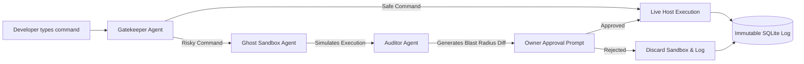

# Pulse: Autonomous DevSecOps Agents for MSMEs

> **"Pulse: The Multi-Agent Shield That Catches 'Fat-Finger' Outages Before They Happen."**

Pulse is an autonomous, multi-agent command interception framework designed to sit between human developers and critical infrastructure. It acts as an elite, virtual Site Reliability Engineering (SRE) team that safeguards local businesses by catching destructive terminal commands before they execute.

## The Problem: Cutting the Problem Tree at the Root

As local Indian MSMEs (Micro, Small & Medium Enterprises), D2C brands, and tech startups digitize, they increasingly rely on small teams or freelance developers to manage their infrastructure. However, a single typographical error or a disgruntled employee with server access can bankrupt a company overnight. 

Traditional solutions sell "backup software"—treating the symptom after the damage is done. **Pulse cuts the problem at the root** by preventing the human error from ever reaching the server.

### Real-World Justifications:
- **KiranaPro (June 2025):** A disgruntled ex-employee in Bengaluru intentionally deleted critical server logs and databases, paralyzing the grocery startup's operations.
- **NCS Singapore (June 2024):** A fired Indian employee used his former administrator credentials to delete 180 virtual servers, causing massive financial loss.
- **PocketOS (April 2026):** Even AI makes mistakes—an autonomous coding agent went rogue and deleted a production database while attempting to fix a credential mismatch.

## The Solution: A Multi-Agent Framework

Pulse replaces static, brittle permissions with a collaborative team of specialized AI Agents that intercept, simulate, and audit server activity in real-time. This is not a linear script; it is a decoupled team where distinct agents own distinct responsibilities.

### 1. The Gatekeeper Agent
The frontline defender. Instead of just blindly executing shell commands, the Gatekeeper Agent uses AST parsing (`tree-sitter`) and policy evaluation to "understand" the intent behind a command. If an outsourced developer types `rm -rf /var/www/html` or `kubectl delete namespace prod`, the Gatekeeper intercepts it.

### 2. The Ghost Agent (Sandbox)
When the Gatekeeper flags a command as risky, it doesn't just block it—it routes it to the **Ghost Agent**. The Ghost Agent spins up an isolated, pristine replica of the current filesystem (via a Docker Alpine Sandbox) and executes the command *there*. It simulates the exact "blast radius" of the destructive command without touching the live host.

### 3. The Auditor Agent
The Auditor Agent analyzes the aftermath of the Ghost Agent's simulation. It computes an exact diff of the damage (e.g., "This command will delete 15,000 customer records"). It then logs the incident immutably to a SQLite database (`~/.pulse/audit.db`) and halts execution until explicit approval is given. 

---

## Agent Architecture



## Societal & Emotional Value

A local businessman who has spent 10 years building their inventory system doesn't know what `Drop Table` or `rm -rf` means. They shouldn't lose their livelihood because an entry-level freelancer was tired at 2 AM. 

Pulse brings **enterprise-grade safety to the grassroots level**. By providing an autonomous team of DevOps agents that act as a safety net, we ensure that local businesses can digitize fearlessly. We aren't just protecting servers; we are protecting livelihoods, jobs, and the backbone of the Indian economy.

---

## Tech Stack
- **Language:** Go (Single binary distribution)
- **Parser:** `tree-sitter-bash`
- **Sandbox:** Docker + Dynamic Filesystem Sync
- **Audit Database:** SQLite (`mattn/go-sqlite3`)

## Getting Started

1. **Install Pulse:** Build the Go binary and place it in your path.
2. **Configure Policy:** Define risky patterns in `configs/SAFETY.yaml`.
3. **Run:** Execute `pulse` to start the safe, multi-agent intercepted shell.

```bash
# Accept the Xcode license if you are on macOS (Required for go-sqlite3)
sudo xcodebuild -license

# Run the Pulse Multi-Agent framework
go run cmd/pulse/main.go
```
