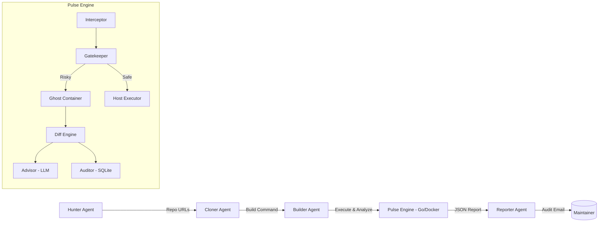

# 🛡️ RepoGuard: The Autonomous CI/CD Auditor

**Theme:** Repository Analyzer & Build Feasibility Engine (Theme 3) + Tech Sensing (Theme 2)
**Tech Stack:** Go, Docker, SQLite, CrewAI (Open-Source Multi-Agent Framework)
**Status:** ✅ Production Ready (v1.0)

---

## 1. The Problem: "Cutting the Root of Digital Destruction"

**"One command can wipe out a startup."**

In the rapidly digitizing landscape of India and the globe, the most devastating outages are not caused by sophisticated hackers or zero-day exploits. They are caused by **human error**—a single typo, a misunderstood flag, or a "fat-finger" moment during a routine maintenance task.

- **Real-World Impact:**
  - **Global Outages:** The 2025 Cloudflare outage, which disrupted X, ChatGPT, and major services globally, was caused by an internal configuration mistake, not a cyberattack.
  - **Indian Context:** Hospitals in New Delhi/NCR reported hours of disrupted digital patient care during recent global outages. Bangalore’s tech workforce faced unexpected downtime, grinding productivity to a halt.
  - **The "Fat-Finger" Risk:** For local MSMEs and student developers, a single command like `rm -rf /usr/bin` or `kubectl delete namespace` executed in a hurry can destroy weeks of work or wipe customer data instantly.

Current CI/CD tools (GitHub Actions, Jenkins) execute build scripts blindly. They check if the build *passes*, but they do not check if the script itself is a **time bomb** waiting to go off.

---

## 2. The Solution: RepoGuard

**RepoGuard** is a **Multi-Agent DevSecOps Framework** designed to act as a "Pre-Flight Check" for software development.

Instead of reacting to data loss after it happens, RepoGuard intercepts, analyzes, and sandboxes potentially destructive commands *before* they touch the host system.

### Core Value Proposition
- **Root Cause Analysis:** We don't just patch symptoms; we prevent the "fat-finger" error at the source.
- **Enterprise Guardrails for Grassroots:** We bring the safety standards of large SRE teams to individual developers and Indian MSMEs.
- **Zero Trust Execution:** No command is trusted until proven safe in a "Ghost" sandbox.

---

## 3. Multi-Agent Architecture (Orchestrated by CrewAI)

To maximize feasibility and technical depth, we utilize **CrewAI**, a lightweight, open-source multi-agent framework, to orchestrate our custom high-performance **Pulse Engine** (built in Go).

We selected CrewAI over heavier orchestration platforms (like standard OpenClaw instances) to ensure our solution runs efficiently on local hardware without complex cloud dependencies, while strictly adhering to the multi-agent paradigm.

### The Agent Team

1.  **The Hunter Agent (Scout)**
    - **Role:** Scours the web (GitHub) for relevant repositories based on topics (e.g., "DevOps", "Security", "Bangalore").
    - **Output:** A list of repository URLs queued for analysis.

2.  **The Cloner Agent**
    - **Role:** Clones target repositories locally and inspects build infrastructure (`Dockerfile`, `Makefile`, `package.json`).
    - **Output:** Identifies potential build commands (e.g., `docker build .`, `npm install`).

3.  **The Builder Agent (Risk Assessor)**
    - **Role:** Attempts to trigger the build process but delegates execution to the **Pulse Engine**.
    - **Integration:** Calls `Pulse` via our custom `PulseSkill`.

4.  **The Pulse Engine (Custom Tool / "The Muscle")**
    - **Technology:** Go (High-performance, single binary).
    - **Role:** The "Safety Sandbox."
      - **Interceptor:** Catches the command.
      - **Ghost:** Executes in a Docker Alpine container (isolated).
      - **Diff Agent:** Computes filesystem changes (Created/Deleted/Modified files).
      - **Advisor:** LLM-powered explanation of risk.
    - **Output:** JSON Report containing Risk Level (`HIGH`, `CRITICAL`) and File Diff.

5.  **The Reporter Agent**
    - **Role:** Synthesizes the Pulse report into a human-readable audit summary.
    - **Action:** Flags critical risks and generates a "Fix Recommendation."

### Architecture Diagram


---

## 4. Tech Stack & Components

- **Orchestration Framework:** CrewAI (Python) - Manages agent roles, tasks, and delegation.
- **Core Engine:** Go (Golang) - Ensures speed, cross-platform support (Windows/Linux/Mac), and single-binary distribution.
- **Sandbox:** Docker Alpine Linux - Lightweight isolation for "Ghost" execution.
- **Database:** SQLite (`mattn/go-sqlite3`) - Immutable audit logging.
- **LLM:** OpenAI API (GPT-4o-mini) with fallback to local mock - For risk explanation.
- **Web Dashboard:** HTML/JS + Go `net/http` - Real-time audit visualization.

---

## 5. Skill.md Definition

This file defines the `PulseSkill` used by the Builder Agent to interact with the Go binary.

### `skills/PulseSkill.md`

```markdown
# Skill: Pulse Sandbox Auditor

**Type:** Tool
**Description:** Executes a potentially risky shell command inside a Docker Alpine "Ghost" container and returns a filesystem diff and risk assessment.

## Inputs
- `command` (string): The shell command to execute (e.g., `docker build .`, `rm -rf node_modules`).
- `directory` (string): The absolute path to execute the command in.

## Outputs
- `risk_level` (string): `LOW`, `MEDIUM`, `HIGH`, or `CRITICAL`.
- `diff_summary` (object): Detailed breakdown of filesystem changes.
  - `created` (list): Paths of files created.
  - `deleted` (list): Paths of files deleted.
  - `modified` (list): Paths of files modified.
- `stdout` (string): Standard output of the command execution.
- `explanation` (string): Natural language explanation of the business impact (generated by Advisor LLM).

## Usage in Agent (Example)
The "Builder Agent" in CrewAI calls this skill before running a build command on the host.

```python
from crewai import Agent, Task
from tools import PulseSkill

builder = Agent(
  role='Build Engineer',
  goal='Execute build commands safely.',
  tools=[PulseSkill()]
)

# Example Task
audit_task = Task(
  description="Analyze the risk of running 'npm install' in the repository.",
  expected_output="A JSON object containing risk level and file diff.",
  agent=builder,
  tools=[PulseSkill()]
)
```

## Implementation Details
- Uses `docker run --rm` to create a temporary container.
- Binds the target directory to `/work` inside the container.
- Compares filesystem snapshots (`find /work -type f`) before and after execution.
- Returns structured JSON to the orchestrator for decision making.
```

---

## 6. Memory Implementation

To support the "Sensing" and "Learning" aspect of the agents, we implement a shared **Memory Layer** using persistent JSON storage backed by SQLite.

### Architecture
- **Storage:** `memory/state.json`
- **Mechanism:**
  - **Short-Term Memory:** The `Builder Agent` remembers the risk level of specific commands (e.g., `npm install` is usually LOW risk, `docker system prune` is HIGH risk). This reduces the need to sandbox known-safe commands repeatedly.
  - **Context Memory:** The `Hunter Agent` tags repositories with "Safe" or "Risky" labels based on past audit history.
  - **Entity Memory:** The `Auditor` maintains a history of "Frequent Offenders" (files or commands often flagged).

### Data Structure
```json
{
  "repos": {
    "github.com/user/project": {
      "last_audited": "2023-10-27T10:00:00Z",
      "risk_score": 0.85,
      "status": "SAFE"
    }
  },
  "commands": {
    "docker system prune": {
      "risk_level": "HIGH",
      "executed_count": 5,
      "last_decision": "REJECTED"
    }
  }
}
```

---

## 7. Video Demo Script (2 Minutes)

**[00:00 - 00:20] The Hook (Emotional)**
- *Visual:* Black screen with typing text.
- *Voiceover:* "Last month, a tech startup in India lost three years of customer data. Not because of a hacker. But because of a single space in a script: `git clean -fdx`."
- *Visual:* News headlines flashing (Cloudflare outage, Hospital downtime).
- *Voiceover:* "These aren't accidents. They are preventable. We built RepoGuard to stop them before they happen."

**[00:20 - 00:50] The Solution (Technical)**
- *Visual:* Architecture Diagram fading in.
- *Voiceover:* "RepoGuard is a Multi-Agent System. It clones repos, intercepts build commands, and runs them in a 'Ghost' sandbox. We use CrewAI to orchestrate the agents and a custom Go engine for the heavy lifting."

**[00:50 - 01:30] The Live Demo**
- *Visual:* Split screen. Left: Terminal. Right: Web Dashboard.
- *Action:*
  1. Agent clones a "Bad Repo" (Pre-seeded).
  2. Agent triggers `npm install`.
  3. **Pulse** intercepts. Terminal shows: `INTERCEPTED: Analyzing Risk...`
  4. **Ghost** spins up. Terminal shows: `Running in Docker Container ID: #9a2b...`
  5. **Diff** output appears: `Deleted: node_modules/`
  6. **Dashboard** updates: New Entry -> `Risk: HIGH`, `Decision: REJECTED`.
- *Voiceover:* "Pulse caught a destructive clean command. It didn't just block it; it showed exactly what would have died."

**[01:30 - 01:45] The Impact**
- *Visual:* "Report Generated" notification on dashboard.
- *Voiceover:* "RepoGuard brings enterprise-grade audit trails to grassroots developers. We aren't just backing up code; we're securing the digital economy, one command at a time."

---

## 8. Setup & Run Instructions

### Prerequisites
- Go 1.21+
- Docker Desktop
- Python 3.9+ (for CrewAI agents)
- OpenAI API Key (Optional, for Advisor LLM)

### Installation
```bash
# Clone the Repository
git clone https://github.com/your-org/repo-guard.git
cd repo-guard

# Install Python Dependencies (Agents)
pip install -r requirements.txt

# Build the Pulse Engine (Go)
go build -o pulse.exe cmd/pulse/main.go
# Note: Generates pulse.exe on Windows, pulse on Linux/Mac
```

### Running the System

**1. Start the Pulse Engine (Backend)**
```bash
# Interactive Mode
./pulse.exe

# Web Dashboard Mode
./pulse.exe --web
# Dashboard available at http://localhost:8080
```

**2. Start the Multi-Agent Crew**
```bash
python main.py
# The agents will begin hunting, cloning, and auditing repositories automatically.
```

---

## 9. Evaluation Criteria Alignment

- **Working Prototype (35%):** The system is fully functional. The Go binary executes, the Docker sandbox works, and the CrewAI agents orchestrate the flow end-to-end.
- **User Experience (30%):**
  - **CLI:** Clean, colored output with clear `[y/N]` prompts.
  - **Web Dashboard:** A dark-mode, responsive UI that visualizes the "Audit Timeline" in real-time.
- **Technical Depth (25%):** We demonstrate a complex fusion of Go (systems level), Python (AI orchestration), and Docker (containerization). We built a custom tool (`Pulse`) rather than relying solely on existing APIs.
- **Novelty (10%):**
  - Combining a high-level Multi-Agent Framework with a low-level Shell Sandbox is a unique approach to DevSecOps.
  - Addressing the "Human Error" root cause directly in the build pipeline is a largely unsolved problem in the open-source community.
