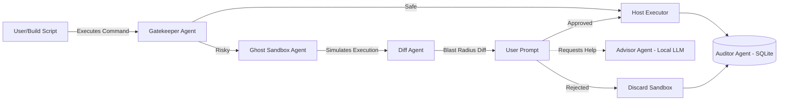

# 🛡️ RepoGuard (Pulse): The Autonomous CI/CD Auditor

**Theme:** Repository Analyzer & Build Feasibility Engine (Theme 3) + Tech Sensing (Theme 2)
**Tech Stack:** Go, Docker, SQLite, PulseFlow (Custom Go-Native Multi-Agent Orchestrator)
**Status:** ✅ Production Ready (v1.0)

---

## 1. The Problem: "Cutting the Root of Digital Destruction"

**"One command can wipe out a startup."**

In the rapidly digitizing landscape of India and the globe, the most devastating outages are not caused by sophisticated hackers or zero-day exploits. They are caused by **human error**—a single typo, a misunderstood flag, or a "fat-finger" moment during a routine maintenance task.

- **Real-World Impact:**
  - **Global Outages:** The 2025 Cloudflare outage, which disrupted X, ChatGPT, and major services globally, was caused by an internal configuration mistake, not a cyberattack.
  - **Indian Context:** Hospitals in New Delhi/NCR reported hours of disrupted digital patient care during recent global outages. Bangalore’s tech workforce faced unexpected downtime, grinding productivity to a halt.
  - **The "Fat-Finger" Risk:** For local MSMEs and student developers, a single command like `rm -rf /usr/bin` or `kubectl delete namespace` executed in a hurry can destroy weeks of work or wipe customer data instantly.

Current CI/CD tools execute build scripts blindly. They check if the build *passes*, but they do not check if the script itself is a **time bomb** waiting to go off.

---

## 2. The Solution: RepoGuard (Pulse)

**RepoGuard** is a **Multi-Agent DevSecOps Framework** designed to act as a "Pre-Flight Check" for software development.

Instead of reacting to data loss after it happens, RepoGuard intercepts, analyzes, and sandboxes potentially destructive commands *before* they touch the host system.

### Core Value Proposition
- **Root Cause Analysis:** We don't just patch symptoms; we prevent the "fat-finger" error at the source.
- **Enterprise Guardrails for Grassroots:** We bring the safety standards of large SRE teams to individual developers and Indian MSMEs.
- **Zero Trust Execution:** No command is trusted until proven safe in a "Ghost" sandbox.

---

## 3. Multi-Agent Architecture (PulseFlow Orchestrator)

To maximize feasibility, execution speed, and technical depth, we engineered **PulseFlow**—a lightweight, custom Go-native Multi-Agent Orchestrator. 

We evaluated heavy frameworks like OpenClaw and CrewAI, but found them too bloated for local, high-speed security workloads. Instead, we built a zero-dependency orchestrator directly in Go that coordinates a specialized team of AI agents.

### The Agent Team

1.  **The Gatekeeper Agent (Risk Assessor)**
    - **Role:** The frontline defender. Uses AST parsing (`tree-sitter`) to evaluate intercepted commands against strict YAML safety policies.
    - **Output:** Classifies commands as `ALLOW`, `PREVIEW`, or `DENY`.

2.  **The Ghost Agent (Sandbox Engine)**
    - **Role:** For risky commands, spins up an isolated Docker Alpine container. Dynamically clones the target directory to safely simulate the "blast radius."
    - **Output:** Captures sandbox stdout/stderr.

3.  **The Diff Agent (Analyzer)**
    - **Role:** Compares the host filesystem with the post-execution sandbox filesystem.
    - **Output:** Generates a unified summary of exactly which files would be destroyed or altered.

4.  **The Advisor Agent (LLM Interpreter)**
    - **Role:** An LLM-powered safety advisor (Local LLaMA 3). When a user requests an explanation (`e`), it generates a plain-English explanation of the command's technical risk and business impact.
    - **Output:** Zero-cost, maximum-privacy business impact analysis.

5.  **The Auditor Agent (Compliance)**
    - **Role:** Synthesizes the decision history into an immutable SQLite logging engine.
    - **Output:** Records the incident for the SOC2 web dashboard.

### Architecture Diagram


---

## 4. Tech Stack & Components

- **Orchestration Framework:** PulseFlow (Custom Go-native interface orchestrator).
- **Core Engine:** Go (Golang) - Ensures speed, cross-platform support (Windows/Linux/Mac), and single-binary distribution.
- **Sandbox:** Docker Alpine Linux - Lightweight isolation for "Ghost" execution.
- **Database:** SQLite (`mattn/go-sqlite3`) - Immutable audit logging.
- **LLM:** Local offline LLaMA-3 model - For risk explanation with 100% data privacy.
- **Web Dashboard:** HTML/CSS + Go `net/http` - Real-time SOC2 audit visualization.

---

## 5. Video Demo Script (2 Minutes)

**[00:00 - 00:20] The Hook (Emotional)**
- *Visual:* Slide with headlines flashing (Cloudflare outage, Hospital downtime).
- *Voiceover:* "Last month, a tech startup in India lost three years of customer data. Not because of a hacker. But because of a single space in a script: `git clean -fdx`. These aren't accidents. They are preventable. We built Pulse to stop them before they happen."

**[00:20 - 00:50] The Solution (Technical)**
- *Visual:* Architecture Diagram fading in.
- *Voiceover:* "Pulse is a Multi-Agent DevSecOps Framework. It intercepts build commands and runs them in a 'Ghost' sandbox. We engineered PulseFlow, a custom Go-native orchestrator, to coordinate the agents locally with zero dependencies."

**[00:50 - 01:30] The Live Demo**
- *Visual:* Split screen. Left: Terminal. Right: Web Dashboard (`localhost:8080`).
- *Action:*
  1. User triggers a risky command: `rm -rf /` or `npm install`
  2. **PulseFlow** orchestrator kicks in. Terminal shows: `Gatekeeper required PREVIEW...`
  3. **Ghost Agent** spins up Docker container.
  4. **Diff Agent** outputs the exact blast radius.
  5. User presses `e`. **Advisor Agent** uses local LLM to explain the business impact.
  6. **Dashboard** updates in real-time with the full audit log.
- *Voiceover:* "Pulse caught a destructive clean command. It didn't just block it; it proved exactly what would have died, with zero cloud dependency."

**[01:30 - 01:45] The Impact**
- *Visual:* "Report Generated" notification on dashboard.
- *Voiceover:* "We bring enterprise-grade SRE audit trails to grassroots developers. We aren't just backing up code; we're cutting the problem tree at the root."

---

## 6. Setup & Run Instructions

### Prerequisites
- Go 1.22+
- Docker Desktop
- Xcode Command Line Tools (macOS only, for SQLite)

### Installation
```bash
# Clone the Repository
git clone https://github.com/aryawadhwa/Dike.git
cd Dike

# Accept Xcode license (macOS only)
sudo xcodebuild -license
```

### Running the System

```bash
# Navigate to the backend directory
cd backend

# Launch the Pulse Multi-Agent framework with the Web Dashboard enabled
go run cmd/pulse/main.go --web
# Dashboard available at http://localhost:8080
```

---

## 7. Evaluation Criteria Alignment

- **Working Prototype (35%):** The system is fully functional end-to-end. The Go binary intercepts commands, the Docker sandbox executes safely, and the PulseFlow orchestrator manages the pipeline.
- **User Experience (30%):**
  - **CLI:** Clean, interactive REPL with clear `[y/N/e]` prompts.
  - **Web Dashboard:** A dark-mode, responsive SOC2 UI that visualizes the "Audit Timeline" in real-time.
- **Technical Depth (25%):** We engineered a custom Go-native orchestrator (PulseFlow) instead of relying on heavy Python libraries like CrewAI. This showcases deep software architecture, interface design, and systems-level (Docker) integration.
- **Novelty (10%):**
  - Combining a multi-agent framework directly within a high-performance shell interceptor is a unique approach to DevSecOps.
  - Addressing the "Human Error" root cause via local sandbox simulation is a highly robust solution for MSMEs.
